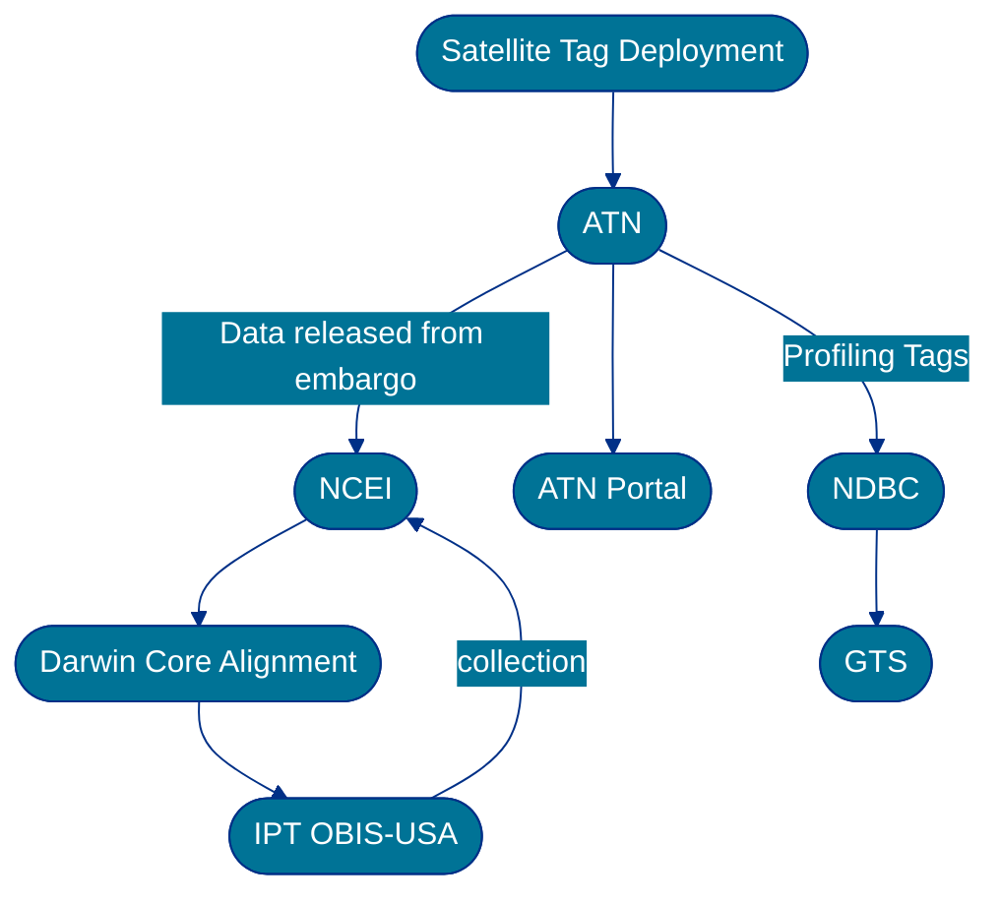
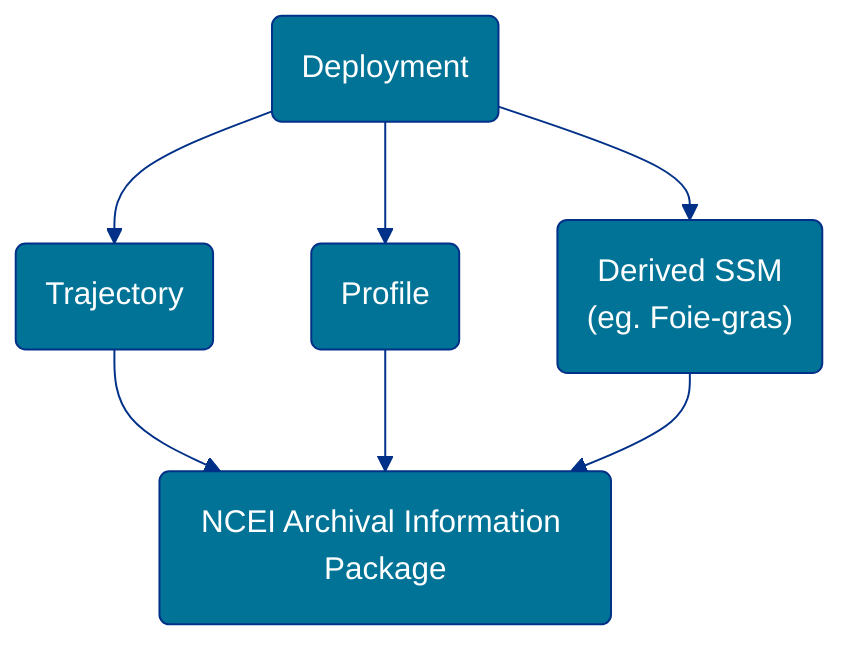

# Archive SOP
This page documents the Standard Operating Procedures for archiving the ATN observations.
The observations have been split into [trajectory](#trajectory) and [profile](#profile) observation types.
Each section below documents the decisions made for the archival of the data at NCEI.

## Data flow


### ATN WAF structure for NCEI pickup


## Trajectory
* Example files can be found at this url: <https://ncei.axiomdatascience.com/atn/test/>
* The netCDF file template can be found at <https://github.com/MathewBiddle/ATN-archive/blob/master/templates/atn_trajectory_template.cdl>

### Archival procedure
* Each Archival Information Package (AIP) will consist of a single tag deployment.
* Describe how the packages will be organized on ATNs server for pickup from NCEI. 
  * The packages will be updated when they become available as deemed appropriate by the scientist or when changes are made to the ATN DAC.
  * Packages will be made available on the web accessible folder (WAF) <https://ncei.axiomdatascience.com/atn/prod/>
  * NCEI will check for new packages **once daily**.
  * Packages will be validated using a single manifest file which contains the md4 checksum for each file to be picked up by NCEI. The file is named `md5.txt` and will be available on the ATN WAF.
* For new submissions (ones that NCEI hasn't made an AIP for yet)
  * The package will be tranferred to NCEI.
  * Once the package has been verified, the manifest files will be discarded as they are artifacts from the transfer.
  * NCEI will extract the metadata from the data and metadata files to populate the AIP metadata record. 
  * NCEI will check metadata to ensure compliance with the agreed upon transfer agreement.
* Updates to already archived packages:
  * Update the *entire* package?
  * How will NCEI know there is a new version? 
    * File checksums don't match.
  * NCEI will **replace** files which have the same filename but differing checksum values.
  * The AIP metadata record will be updated to reflect the change in the AIP contents.
* The data will be served according to Tier 1 stewardship (basic access), and Tier 2 (enhanced access) by providing access to the netCDF files via [THREDDS](https://www.ncei.noaa.gov/thredds-ocean/catalog/catalog.html). 

### NCEI checks on the package
1. Package structure follows the identified [structure below](#submission-information-package-structure).
1. Checksums match.
1. File names match the identified convention described in [File naming convention](#file-naming-convention).
1. Validate sea names against NCEI authority table.
1. Validate variable names against NCEI authority table.
1. Check people against ORCID
1. Lat/Lon points are valid according to units.
1. Times are valid according to units.

### File naming convention
Template | Example
---------|---------
`atn_`[_ptt id_]`_`[_animal common name_]`_trajectory_`[_deployment start date_]-[_deployment end date_]`.nc` |   `atn_38553_bearded-seal_trajectory_20110617-20120313.nc`  

Variable | Description | Example
---------|-------------|--------
_ptt id_ | Platform Transmitter Tag code. PTT codes may be used on multiple deployments, but  not concurrently. When combined with deployment dates, PTTs can uniquely identify a deployment. | `38553`
_animal common name_ | Common name of the species being tracked with spaces removed. | `bearded_seal`
_deployment start date_ | Start of the deployment. Following format YYYYMMDDTHHmmssZ | `20110617`
_deployment end date_ | End of the deployment. Following format YYYYMMDDTHHmmssZ | `20120313`

### Submission Information Package structure
This sections contains an example of what the intended submission package will look like on the ATN Web Accessible Folder (WAF). Each deployment is a separate file and will be archived as an independent Archival Information Package (NCEI Accession).
```
Index of /atn/prod/
atn_38553_bearded-seal_trajectory_20110617-2012..> 30-Apr-2024 18:29             2515242
atn_39489_bearded-seal_trajectory_20110616-2012..> 30-Apr-2024 18:29             2425934
atn_64459_bearded-seal_trajectory_20090625-2012..> 30-Apr-2024 18:29              136505
atn_64462_bearded-seal_trajectory_20090622-2012..> 30-Apr-2024 18:29              151849
atn_66971_bearded-seal_trajectory_20110616-2012..> 30-Apr-2024 18:29             1936257
atn_66983_bearded-seal_trajectory_20110617-2014..> 30-Apr-2024 18:29              158410
atn_67004_bearded-seal_trajectory_20120703-2013..> 30-Apr-2024 18:29              148087
atn_67007_bearded-seal_trajectory_20110616-2012..> 30-Apr-2024 18:29              147924
atn_74626_bearded-seal_trajectory_20090624-2010..> 30-Apr-2024 18:29             1479689
atn_74627_bearded-seal_trajectory_20090622-2010..> 30-Apr-2024 18:29             1691372
atn_74630_bearded-seal_trajectory_20090625-2010..> 30-Apr-2024 18:29             1304864
atn_83904_bearded-seal_trajectory_20090624-2012..> 30-Apr-2024 18:29              147551
atn_99287_bearded-seal_trajectory_20120703-2013..> 30-Apr-2024 18:29             2455893
atn_99310_bearded-seal_trajectory_20110616-2012..> 30-Apr-2024 18:29              159061
md5.txt                                            30-Apr-2024 18:29                1246
```

### Package sizes
These are approximate sizes of an entire SIP.
Package | SIP Size (B)
--------|---------
atn_38553_bearded-seal_trajectory_20110617-20120313.nc | 2515242
atn_39489_bearded-seal_trajectory_20110616-20120401.nc | 2425934
atn_64459_bearded-seal_trajectory_20090625-20120517.nc | 136505
atn_64462_bearded-seal_trajectory_20090622-20120611.nc | 151849
atn_66983_bearded-seal_trajectory_20110617-20140625.nc | 1936257

## Profile

### Archival procedure

### NCEI checks on the package


### File naming convention
Template | Example
---------|---------


Variable | Description | Example
---------|-------------|--------

