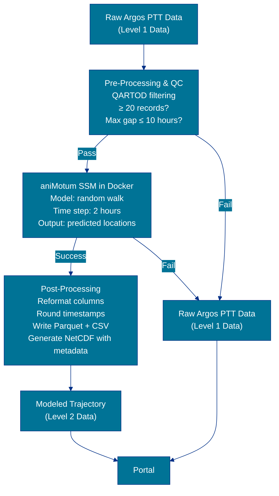

# ATN State Space Model Processing with aniMotum

## Overview

The [Animal Telemetry Network (ATN)](https://atn.ioos.us/) processes raw animal tracking data through a State Space Model (SSM) to produce cleaned, regularized location estimates. The SSM used is implemented by the open-source R package [**aniMotum**](https://github.com/ianjonsen/aniMotum) (formerly known as **`foieGras`**). This processing is a standard step in the ATN data pipeline for Argos satellite-tracked animals.

## Background: What Is a State Space Model?

Animal locations collected via the [Argos satellite system](https://www.argos-system.org/) are inherently noisy and irregularly spaced in time. The Argos system assigns a Location Class (LC) to each position fix, reflecting the estimated accuracy of that fix. Some tags also transmit Fastloc GPS data via Argos: when an animal surfaces, the tag rapidly acquires a snapshot of GPS satellite signals in milliseconds; the raw pseudoranges are then transmitted via the Argos network, and position solutions are derived through post-processing.

Fastloc GPS positions are assigned LC `G` and yield significantly higher accuracy than traditional Argos Doppler positions (typically ~20–50 m). Both Argos LC and Fastloc GPS data are treated as input streams for aniMotum SSM processing, with aniMotum applying the appropriate error model for each location type. All LC codes used in ATN processing are summarized below:

| LC | Type | Accuracy (approx.) |
|----|------|---------------------|
| `G` | Fastloc GPS (via Argos) | < 100 m, typically ~20–50 m |
| `3` | Argos Doppler | < 250 m |
| `2` | Argos Doppler | 250–500 m |
| `1` | Argos Doppler | 500–1500 m |
| `0` | Argos Doppler | > 1500 m |
| `A` | Argos Doppler | No accuracy estimate |
| `B` | Argos Doppler | No accuracy estimate |
| `Z` | Argos Doppler | Invalid fix |

A State Space Model (SSM) is a statistical framework that:
1. Accounts for the error in each observed location (using LC-based error ellipses)
2. Models the animal's underlying movement process (e.g., as a random walk)
3. Produces regularized predicted locations at a fixed time step, with associated uncertainty

The result is a smoother, more ecologically interpretable track compared to raw Argos positions.

For more technical detail, see the aniMotum documentation and associated publications:
- [aniMotum Official Documentation](https://ianjonsen.github.io/aniMotum/)
- [aniMotum GitHub](https://github.com/ianjonsen/aniMotum)
- Jonsen et al. (2023), *Methods in Ecology and Evolution* — [doi:10.1111/2041-210X.14060](https://doi.org/10.1111/2041-210X.14060)

## Input Data

### What Animals / Tags Are Processed

The SSM pipeline processes location data **exclusively from animals equipped with Argos satellite-linked transmitters** (also called PTTs — Platform Transmitter Terminals). This includes:
- Traditional Argos Location Class (LC) positions transmitted directly to the Argos constellation
- Fastloc GPS data transmitted via Argos (with associated quality metrics)

These tags transmit raw position fixes to the Argos satellite system, which are then processed through aniMotum to improve accuracy and regularity.

Other tracking technologies, such as Wildlife Computers pop-up tags processed via GPE3 geolocation algorithms, bypass aniMotum SSM processing and use alternative quality-control and estimation methods. Only Argos-derived data (regardless of location method) enters the aniMotum pipeline.

### Required Input Fields

Each record submitted to the model must contain the following columns:

| Column | Description |
|--------|-------------|
| `id` | Unique identifier for the tag/deployment |
| `date` | Timestamp of the location fix (UTC) |
| `lc` | Argos Location Class (G, 3, 2, 1, 0, A, B, Z) |
| `lon` | Longitude (decimal degrees) |
| `lat` | Latitude (decimal degrees) |
| `smaj` | Semi-major axis of the Argos error ellipse (meters) — optional for LC `G`, required for others |
| `smin` | Semi-minor axis of the Argos error ellipse (meters) — optional for LC `G`, required for others |
| `eor` | Ellipse orientation/rotation (degrees from north) — optional for LC `G`, required for others |

Rows with missing `lc` values are dropped prior to processing, as they cause errors in the SSM fitting step.

For `G` (Fastloc GPS) locations, the `smaj`, `smin`, and `eor` fields can be set to `NA`, as aniMotum applies the appropriate measurement error model based on location class. Deployments may contain mixed location types (Argos, GPS, etc.); aniMotum handles the different error models accordingly.

## Pre-Processing Validation

Before running the model, the following checks and filters are applied to ensure the data are suitable for SSM fitting:

### 1. Missing Critical Fields
Rows with missing values in critical columns (`date`, `lon`, `lat`, `lc`) are dropped, as these are essential for SSM fitting.

### 2. QARTOD QC Filtering
If a QARTOD rollup quality control column exists, all rows where the QC value is 4 (failed) are removed. The code recognizes: 1=Pass, 2=Not evaluated, 3=Suspect, 4=Fail, 9=Missing.

### 3. Minimum Record Threshold
A **minimum of 20 location records** is required after filtering. Fewer records are considered insufficient for the model to converge to a reliable solution.

> *Threshold based on recommendation from Ian Jonsen, the developer of aniMotum.*

### 4. Maximum Time Gap Check
The model runs at a fixed **2-hour time step**. If any consecutive pair of records has a gap exceeding **10 hours** (5× the 2-hour time step), the model is unlikely to converge and processing is skipped for that deployment.

> *Gap threshold also based on Ian Jonsen's recommendation.*

If any check fails, a warning is logged, the deployment is skipped, and the reason is recorded.

## The aniMotum Model

ATN runs aniMotum inside a Docker container, which packages the R environment and the aniMotum package to ensure reproducibility and environment isolation. The container is invoked once per deployment.

### Model Configuration

| Parameter | ATN Setting | Description |
|-----------|-------------|-------------|
| `model` | `"rw"` (random walk) | Movement model type. `"rw"` models position only. |
| `time_step` | `2.0` hours | The fixed interval at which predicted locations are output |
| `fit_type` | `"p"` (predicted) | Returns predicted positions at regular time steps |

## Output Data

### What the Model Produces

The aniMotum model outputs a CSV of regularized predicted locations at the configured 2-hour time step. ATN post-processes this output into two formats:

#### 1. Parquet File
A binary columnar data file (Apache Parquet, Snappy-compressed) with:
- Predicted locations including:
  - Geodetic coordinates: `lon`, `lat` (decimal degrees)
  - Projected coordinates: `x`, `y` (km, using Mercator projection EPSG 3395)
  - Position error estimates: `x.se`, `y.se` (km, standard errors in x and y directions)
- A depth variable `z` set to `0` (surface assumed)
- Metadata attributes (see below)
- Timestamps rounded to the nearest second (in UTC)

#### 2. CSV File
A plain-text version of the same predicted locations, with timestamps in `YYYY-MM-DD HH:MM:SS+00:00` format (e.g., `2024-10-24 00:00:00+00:00`), including the position error estimates (`x.se` and `y.se`).

### Metadata Added to Output Files

When results are packaged as a NetCDF trajectory file (using the [pocean-core](https://pyocean.readthedocs.io/) library in CF (Climate and Forecast) conventions-compliant `IncompleteMultidimensionalTrajectory` format), the following metadata fields are populated:

| Attribute | Value / Source |
|-----------|---------------|
| `processing_level` | "NOAA IOOS ATN Level 2 Data Product produced from modeling raw Argos satellite tracks using aniMotum" |
| `source` | `"aniMotum"` |
| `keywords` | `"atn, ioos, trajectory, animotum"` |
| `license` | Open Database License (ODbL) |
| `title` | Auto-generated from species, PTT, date range, sea name, and aniMotum version |
| `summary` | Auto-generated narrative describing the deployment |
| `uuid` / `platform_id` / `vendor_id` | Set from the ATN source dataset identifier |
| `history` | Timestamped creation record (e.g., `2024-01-15T12:00:00Z - Created by the IOOS ATN DAC from an aniMotum model run`) |
| `time_coverage_start` / `_end` | Derived from the data |

### Data Products

Processed outputs of the aniMotum SSM are designated as **ATN Level 2 Data Products**. Only deployments that pass pre-processing validation and produce a successful model fit will have Level 2 results. Deployments that are skipped or fail to converge retain only their Level 1 raw Argos data.

**Level 2 outputs include**:
- **Parquet file**: Binary columnar format with predicted trajectory locations, coordinates, and position errors
- **CSV file**: Plain-text version of the same trajectory data
- **NetCDF file**: CF-convention compliant trajectory file with full metadata describing the deployment, species, processing provenance, and temporal/spatial coverage

These Level 2 Data Products are made available through data archival systems and the [ATN Data Portal](https://portal.atn.ioos.us/), subject to any applicable embargo periods.

## Summary Flow

