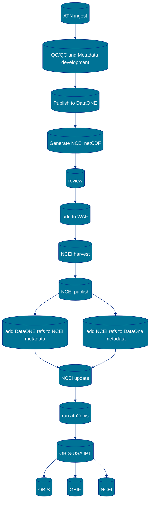

# Mapping ATN satellite telemetry template to Darwin Core
This page documents the Standard Operating Procedures for mapping the ATN observations into Darwin Core.
The observations have been split into [trajectory](#trajectory) and [profile](#profile) observation types.
Each section below documents the decisions made for the translation of the ATN netCDF data into DarwinCore.

## Trajectory
See this [Python library](https://github.com/MathewBiddle/atn2obis/tree/main) on performing the translation. A short summary and data flow diagram are below.

### Step-by-step
1. Pulls source netCDF data directly from NCEI.
2. Ingests netCDF data and translates to DarwinCore format
3. Creates applicable eml metadata.
4. Creates applicable file column mapping xml file.
5. Zips everything together into a compliant DwC Archive package.
6. Automatically publish DwC Archive package to OBIS-USA IPT.
7. Provide capability to version control updates to the datasets on the OBIS-USA IPT by: updating of eml metadata, updating of data files, and republishing.

### Data flow diagram
_rough draft on 2025-11-20_

## Profile
TBD
