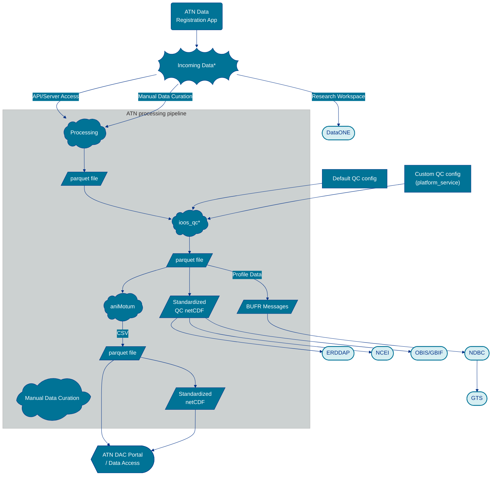

# Standard operating procedure for the Animal Telemetry Network 
This page documents the standard operating procedures for data flow in the U.S. Animal Telemetry Network (ATN) to various data repositories, national archive locations, servers, and the ATN data portal to increase discoverability, accessibility, and re-usability of ATN data. 

## Data Flow Summary

The diagram shows the ATN data ingestion and processing pipeline, from incoming data sources through QC, format conversion, and distribution pathways.

## Incoming data sources

More details coming soon on incoming data sources, QC configuration, processing, and data distribution!