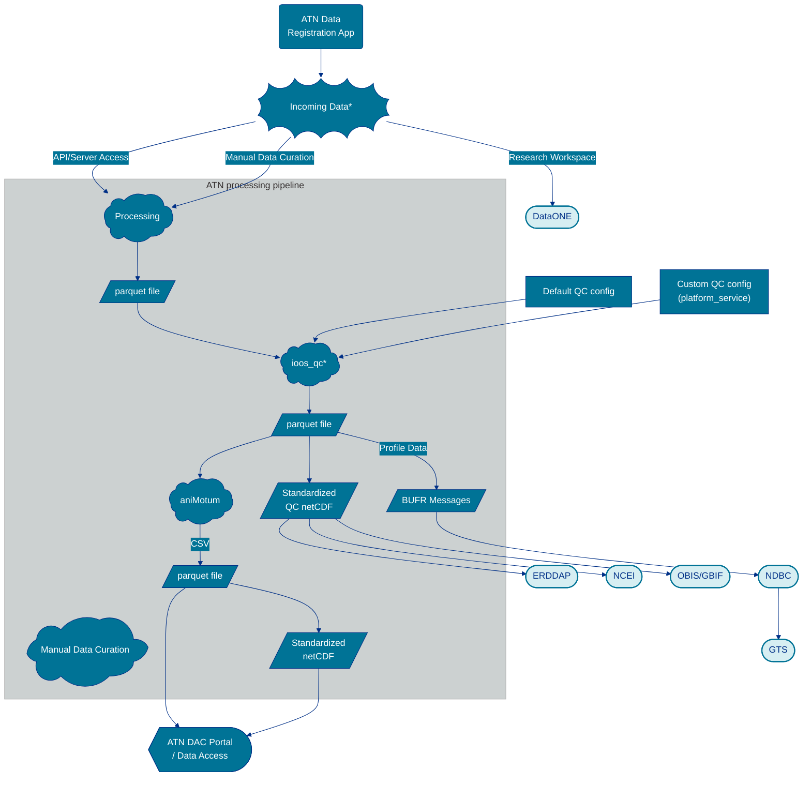

# Standard operating procedure for the Animal Telemetry Network 
This page documents the standard operating procedures for data flow in the U.S. Animal Telemetry Network (ATN) to various data repositories, national archive locations, servers, and the ATN data portal to increase discoverability, accessibility, and re-usability of ATN data. 

## Data Flow Summary

The diagram shows the ATN data ingestion and processing pipeline, from incoming data sources through QC, format conversion, and distribution pathways.

```mermaid
%%{
  init: {
    'theme': 'base',
    'themeVariables': {
      'primaryColor': '#007396',
      'primaryTextColor': '#fff',
      'primaryBorderColor': '#003087',
      'lineColor': '#003087',
      'secondaryColor': '#007396',
      'tertiaryColor': '#CCD1D1'
    },
   'flowchart': { 'curve': 'basis' }
  }
}%%

flowchart TB

  %% -----------------------
  %% Top-level data sources
  %% -----------------------
  ATNApp(ATN Data<br/>Registration App)
  Incoming["Incoming Data*"]@{ shape: bang}

  ATNApp --> Incoming


  %% -----------------------
  %% QC configuration
  %% -----------------------
  DefaultQC[Default QC config]
  CustomQC["Custom QC config<br/>(platform_service)"]
  %% ATN processing pipeline
  %% -----------------------
  subgraph PIPELINE[ATN processing pipeline]
    Processing((Processing))@{ shape: cloud }
    Manual(("Manual Data Curation"))@{ shape: cloud }
    PQ1[/parquet file/]
    IOOSQC((ioos_qc*))@{ shape: cloud }
    PQ2[/parquet file/]
    AniMotum((aniMotum))@{ shape: cloud }
    PQ3[/parquet file/]
    StdNC[/"Standardized<br/>netCDF"/]
    StdQCNC[/"Standardized<br/>QC netCDF"/]
    BUFR[/BUFR Messages/]
  end

  %% Pipeline flow
  Incoming --> |API/Server Access| Processing
  Incoming --> |Manual Data Curation| Processing
  Incoming -->|Research Workspace| DataONE
  Processing --> PQ1
  PQ1 --> IOOSQC
  DefaultQC --> IOOSQC
  CustomQC --> IOOSQC

  IOOSQC --> PQ2

  %% Profile branch
  PQ2 --> StdQCNC

  %% Non-profile branch
  PQ2 --> AniMotum
  AniMotum -->|CSV| PQ3
  PQ3 --> StdNC

  %% BUFR path
  PQ2 -->|Profile Data| BUFR

  %% -----------------------
  %% Data access & delivery
  %% -----------------------
  DAC["ATN DAC Portal<br/>/ Data Access"]@{ shape: curv-trap}
  
  PQ3 --> DAC
  StdNC --> DAC

  %% -----------------------
  %% Final repositories
  %% -----------------------
  DataONE([DataONE])
  ERDDAP([ERDDAP])
  NCEI([NCEI])
  OBIS([OBIS/GBIF])
  NDBC([NDBC])
  GTS([GTS])

  BUFR --> NDBC
  StdQCNC --> ERDDAP
  StdQCNC --> NCEI
  StdQCNC --> OBIS
  NDBC --> GTS

  %% -----------------------
  %% Styling for final repositories
  %% -----------------------
  classDef finalRepo fill:#D6EEF2,stroke:#007396,stroke-width:2px,color:#003087;

  class DataONE,ERDDAP,NCEI,OBIS,NDBC,GTS finalRepo;
```

## Incoming Data Sources

The ATN DAC aggregates data from a variety of data sources both manually transferred by data providers or sourced directly from a tag manufacturer's API or web server when available. ATN projects and new deployments need to first be registered through the [ATN Data Registration App (ADR)](https://dacregistration.atn.ioos.us/accounts/login/?next=/) in order to be integrated into the ATN DAC. After registration, the ATN Data Coordinator will work with the data provider(s) to ensure metadata have been appropriately provide and confirm approval of data relase prior to integration into the DAC. 

Once approved and released, the ATN DAC can pull deployment data automatically from the following tag manufacturers, checking for incoming data every 30 minutes or every 2 hours, depending on the source:
- [Wildlife Computers](https://wildlifecomputers.com/) (WC)
- [Sea Mammal Research Unit](https://www.smru.st-andrews.ac.uk/index.html) (SMRU)
- [Woods Hole Group (a CLS North American company)](https://www.woodsholegroup.com/)

Manual data integration is required when deployment or tag data are not available through a web-accessible pathway listed above. For these cases, PIs can work with the ATN Data Coordinator after registering their project in the ADR to gain access to the ATN Research Workspace Campaign for secure transfers. 

Examples of manual data integration include:
- Tags manufacturered by providers other than Wildlife Computers, Sea Mammal Research Unit, or Woods Hole Group
- Data recovered directly from a tag, such as pop-up satellite archival tags (PSAT), that are not accessible from one of the above data sources
- Historical, legacy, or otherwise non-standard datasets that require additional review, mapping, or reformatting before they can enter the standard processing workflow
- Data for which access credentials, release permissions, metadata, or other required information are not yet available through an automated connection

Manual ingestion may include additional coordination with data providers and ATN Data Coordinator, obtaining the source files and associated metadata, mapping the data to standardized formatting for ATN DAC integration, and conducting data review and quality control. The ATN DAC will periodically assess manually integrated data sources for potential automation and streamlining as tag manufacturer access methods and data-sharing agreements evolve.

All ATN data can be viewed on the ATN Data Portal [here](https://portal.atn.ioos.us/?ls=HKwofDkA#map), and deployment data from the past 30-days viewable [here](https://portal.atn.ioos.us/?ls=q2VLkmP-#map).

## Processing

Incoming data, regardless of source, are processed into parquet files, standardized into netCDF, and quality controlled for integration into the ATN Data Portal and downstream data access points and archive repositories.

Deployments with animal-borne ocean profile data will get further processed into BUFR messages for submission to National Data Buoy Center (NDBC) and incorporation into the [Global Telecommunications System](https://community.wmo.int/site/knowledge-hub/programmes-and-initiatives/global-telecommunication-system-gts) (see [NDBC Submission](https://ioos.github.io/ioos-atn-data/ndbc-gts.html) section).

Animal trajectory data may be used as input into a state space model for modeled location estimates if it meets model input requirements (read more [here](https://ioos.github.io/ioos-atn-data/animotum.html)). If available, visualizations of the modeled location estimates will show up on the Platform Deployment pages.

## Data Distribution

Processed ATN data are distributed to the [ATN Data Portal](https://portal.atn.ioos.us/), which provides access to deployment metadata, animal tracks, environmental observations, profile measurements, and derived data products such as state space model outputs (read more [here](https://ioos.github.io/ioos-atn-data/animotum.html)) when available. The portal serves as the primary user-facing access point for discovering, viewing, and exploring ATN datasets.

Data products may then be distributed to downstream repositories and services for additional discoverability, access, and archival functions based on the data type and format, processing status, and criteria of receiving repositories:
* **NDBC** receives animal-borne ocean profile observations formatted as BUFR messages for incorporation into the Global Telecommunications System (GTS) (read more [here](https://ioos.github.io/ioos-atn-data/ndbc-gts.html))
* **NCEI** provides long-term archival storage for standardized quality-controlled netCDF data and associated metadata (read more [here](https://ioos.github.io/ioos-atn-data/atn-archive.html))
* The [**IOOS ATN ERDDAP**](https://atn.ioos.us/erddap/index.html) provides programmatic access to standardized ATN datasets and supports data querying and download
* **OBIS/GBIF** receives appropriate animal tracking and occurrence-related data products to support biodiversity data discovery and reuse (read more [here](https://ioos.github.io/ioos-atn-data/atn-darwin-core.html))

Historically, ATN data publications were made available through [DataONE](https://search.dataone.org/data). These publications may include the full range of project data and supporting materials, including animal trajectory data, animal-borne ocean profile data, miscellaneous source files, documentation, and other project-level data products.

Beginning in 2025, the ATN DAC began regularly submitting standardized animal trajectory data to NCEI as part of an effort to establish NCEI as the primary long-term archival location for ATN data. The current NCEI submissions are limited primarily to trajectory data, but the ATN DAC is working toward expanding these submissions to include the broader collection of data previously published through DataONE, as well as derived products produced by the ATN DAC such as state space model location estimates.

The IOOS ATN ERDDAP and OBIS/GBIF distributions are also currently based primarily on the standardized trajectory datasets submitted to NCEI. A small subset of ATN trajectory data has been submitted to OBIS, but additional adaptations are needed to align the data with OBIS/GBIF requirements and support broader distribution. As the ATN DAC expands the scope of its NCEI submissions and improves alignment with downstream repository requirements, additional ATN data types and derived products may become available through these services.

For NDBC submission, the current automated workflow supports SMRU animal-borne ocean profile data that meet the required format and quality-control criteria. The ATN DAC continues to evaluate opportunities to extend this capability to additional data sources and manufacturers.